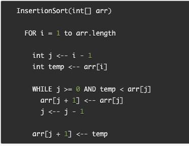
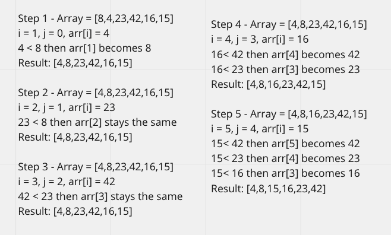

# Challenge Summary
I wrote a blog detailing how the pseudo code works and drew a visual of how the insertion sort function works. I also coded the Insertion Sort function that iterates over an array and returns the values of an array from least to greatest.

## Challenge Description
Review the pseudocode below, then trace the algorithm by stepping through the process with the provided sample array. Document your explanation by creating a blog article that shows the step-by-step output after each iteration through some sort of visual. Once you are done with your article, code a working, tested implementation of Insertion Sort based on the pseudocode provided.

## Approach & Efficiency
Big 0 Space: O(1)
Big O Time: O(n^2)

## Pseudocode

## Solution
