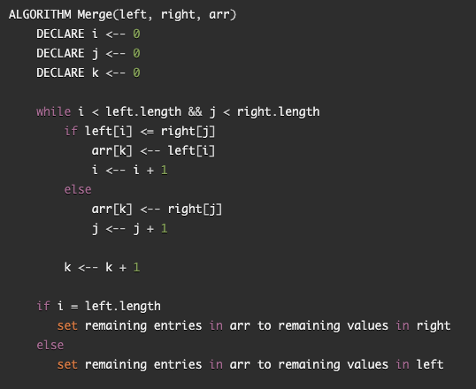
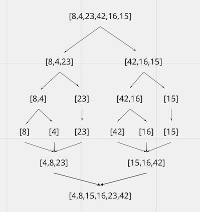

# Merge Sort 
Merge Sort is an algorithm and sorting technique based on "divided and conquer" paradigm. In merge sort, the array is divided into two in every interation. It breaks down the array into two continually until each avleu is only left with two. Conquer essentially merges the two sorted arrays into the original array.

## Pseudocode

## Step Through Process
- Sample Array [8,4,23,42,16,15]

- Step 1: Merge sort will take in an array and split the length of the array in half. If the array has an odd number, the array will be split in half still with the larger portion of the array going to the left. 
- Step 2: A while loop will continue to loop over the array until every value is individually sorted. The left side of the array will contain values 8,4, and 23. MergeSort will then divide the array again having the 8 and 4 values divided from the 23.
- Step 3: Merge sort will then Divide the 8 and 4 values and on the left side of the original array there will be three individual values of 8,4, and 23. 
- Step 4: The values will then be added back into an array in order from least to greatest resulting in an array of [4,8,23].
- Step 5: The original right side of the array [42,16,15] will also go through the merge sort function in the same process.
- Step 6: After the while loop iterates until the values of 42,16,15 are independent, the value will then be placed in an array in order from least to greatest resulting an array of [15,16,42]
- Step 7: Lastsly the two arrays of [4,8,23] and [15,16,42] will merge with the values in order from least to greatest and result in an ending array of [4,8,15,16,23,42].

## Visual
