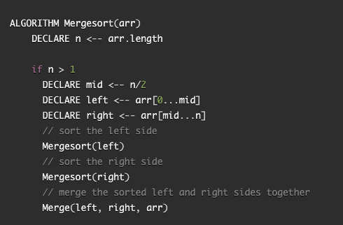

# Challenge Summary
I wrote a blog detailing how the pseudo code works and drew a visual of how the merge sort function works. 

## Challenge Description

## Approach & Efficiency
Big 0 Space: 
Big O Time: 

## Pseudocode

## Solution
