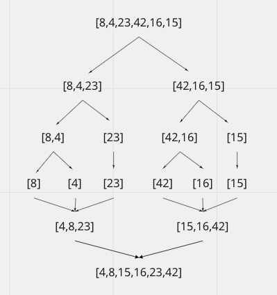

# Challenge Summary
I wrote a blog detailing how the merge sort pseudo code works and drew a visual to get a better idea of its workings. I also created functional working code that is being tested.  

## Challenge Description
Review the pseudocode below, then trace the algorithm by stepping through the process with the provided sample array. Document your explanation by creating a blog article that shows the step-by-step output after each iteration through some sort of visual. Once you are done with your article, code a working, tested implementation of Merge Sort based on the pseudocode provided.

## Approach & Efficiency
Big 0 Space: O(n)
Big O Time: O(nlogn)

## Pseudocode

## Solution Visual

