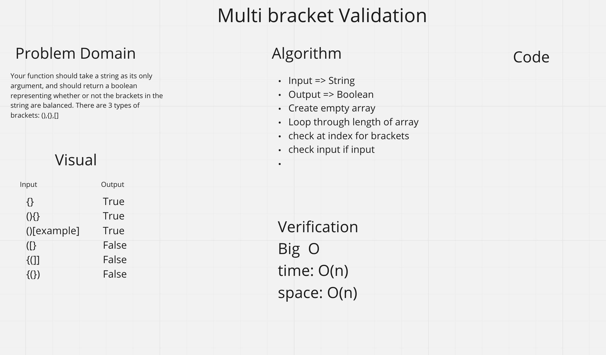

# Multi-Bracket Validation

## Challenge
Your function should take a string as its only argument, and should return a boolean representing whether or not the brackets in the string are balanced. There are 3 types of brackets:

Round Brackets : ()
Square Brackets : []
Curly Brackets : {}

## Approach and Efficiency 
Big O space is O(n) and time is on O(n)

## API 

## UML
