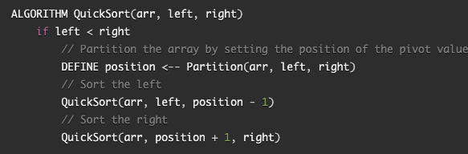
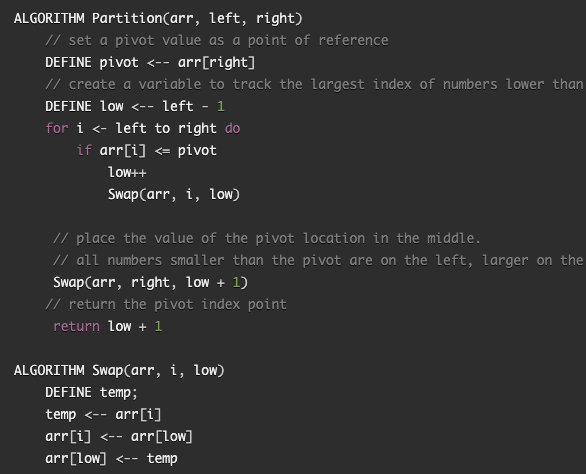
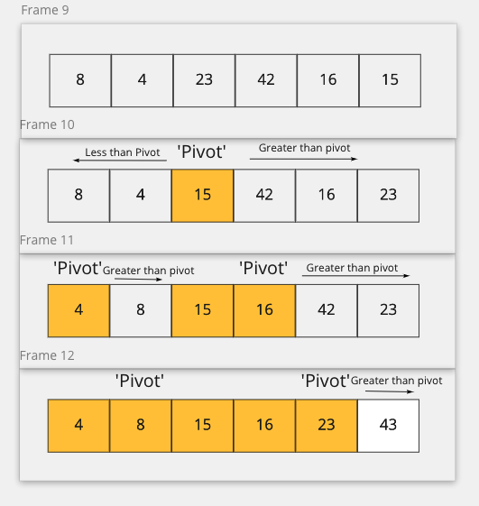

# Merge Sort 
Quick Sort is an algorithm and sorting technique based on "divided and conquer" paradigm. In quick sort, an initial element is used in an array and is called the 'pivot'. The remaining elements in the array are then moved to either the left if they are less than the 'pivot' or to the right if they are more than the 'pivot'. I 'pivot' will be re-identified until every element is looped over and the resulting array will be elements in order from least to greatest. 

## Pseudocode

## Step Through Process
- Sample Array [8,4,23,42,16,15]

- Step 1: Quick Sort will identify an element within an array and define the element as a 'pivot'. In this case start with '15'.
- Step 2: After the 'pivot' is defined, the remaining elements will be sorted either to the left if their value is less than the 'pivot' or to the right if their value is more than the 'pivot'. The 'pivot' will then be cemented within the array. 
- Step 3: The next 'pivot' will sort the elements to the right of the last 'pivot' and will place itself accordingly within the array depending on whether the values are less than or more than the 'pivot' element. The 'pivot' will then be cemented within the array.
- Step 4: The last step will be repeated until every element within in the array has been used as a 'pivot' and the resulting array will be [4,8,15,16,23,42].

## Visual
